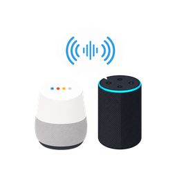

# HA Speaks

HA Speaks is a Home Assistant custom integration plus a Hubitat virtual speech
driver. Hubitat sends a simple speech request to Home Assistant, and Home
Assistant fans it out to configured speech groups such as `Everywhere` or
`Downstairs`.



This first version focuses on Home Assistant `media_player` targets, including
Google Cast devices, using Home Assistant's TTS service. It also includes an
optional Alexa Media Player notification path for Echo announcements if that
custom integration is installed in Home Assistant.

## Home Assistant Install

1. Copy `custom_components/ha_speaks` into your Home Assistant
   `custom_components` directory.
2. Restart Home Assistant.
3. Go to **Settings > Devices & services > Add integration** and add
   **HA Speaks**.
4. Open **Configure** on the integration to add speech groups.

## HACS Custom Repository Install

After this project is published to GitHub, add the repository to HACS as a
custom repository with category **Integration**. HACS will install the
`custom_components/ha_speaks` integration directory.

Each group can include Home Assistant `media_player` entities. For Google Home
devices, use the entities created by the Google Cast integration.

Configured speech groups appear as HA Speaks sensor entities. The sensor state
is the number of targets in the group, and the attributes list the media players
and optional Alexa targets assigned to that group.

For Amazon Echo devices, install the Alexa Media Player custom integration. Once
it is configured, Echo devices should appear in Home Assistant as
`media_player` entities. Add those devices to the group's **Alexa media
players** field so HA Speaks uses `notify.alexa_media` announcements instead of
Home Assistant TTS.

## TTS Setup

The integration calls Home Assistant's modern `tts.speak` service by default.
You need a TTS entity configured in Home Assistant, for example Home Assistant
Cloud, Piper, or another TTS provider.

The default TTS entity is selected when adding the integration. You can change
it later from the integration's Configure screen.

## Service

Call:

```yaml
service: ha_speaks.announce
data:
  message: "Message text goes here"
  group: "Everywhere"
  volume: 80
```

`volume` is a Hubitat-style 0-100 value and is mapped to Home Assistant's
0.0-1.0 media player volume scale.

You can also bypass groups:

```yaml
service: ha_speaks.announce
data:
  message: "Dinner is ready"
  media_player_entity_ids:
    - media_player.kitchen_display
    - media_player.living_room_speaker
```

For explicit Echo targets:

```yaml
service: ha_speaks.announce
data:
  message: "Dinner is ready"
  alexa_media_player_entity_ids:
    - media_player.kitchen_echo
  volume: 60
```

## Hubitat Install

1. In Hubitat, go to **Drivers Code**.
2. Add the contents of `hubitat/ha-speaks-speech-engine-driver.groovy`.
3. Create a virtual device using the **HA Speaks Speech Engine** driver.
4. Set preferences:
   - Home Assistant base URL, such as `http://homeassistant.local:8123`
   - A Home Assistant long-lived access token
   - Default group, such as `Everywhere`
   - Default volume, such as `80`

The Hubitat driver implements `SpeechSynthesis.speak(message)`, plus
`speakToGroup(message, group, volume)`.

## Echo Support Notes

Home Assistant does not include a native Echo speaker broadcast integration.
The common path is the Alexa Media Player custom integration, which exposes
`notify.alexa_media`. HA Speaks can call that service for configured Alexa
targets, but this path depends on the service being available in your Home
Assistant instance.
